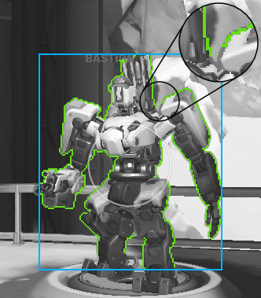

# Horus
OBS plugin for Overwatch enemy detection using OpenCV and CUDA.

* Detects enemy hulls in 1.3 - 3.0 ms.
* Detects enemy polygons in 2.1 - 6.1 ms.

At 120 FPS, the total delay between mouse movement recognized by the system (DirectInput)
and new enemy positions recognized by the plugin ranges between 1.3 and 14.4 ms.

## Why
This is a hobby. I write cheats for games once every few years.

Usually, there are two types of cheats.

1. Internal - when the game process is hooked and executes your code.<br/>
   An example for CS:GO can be found [here](https://github.com/qis/jeeves).

2. External - when the game memory is read by an external process.<br/>
   An example for Overwatch that uses a system driver can be found
   [here](https://github.com/qis/overwatch).

There are ways to detect both approaches, even if anti-cheat software fails to do so.

This project falls into a separate category that uses image processing to detect enemies on
the screen and external hardware that simulates a mouse for input.

Detecting this solution without limiting the use of legitimate software like OBS is much
harder and nobody has done this yet.

## How
Short summary of what this plugin does.

1. Registers itself as a filter plygin in OBS and receives captured frames.

   

2. Converts each frame to the HSV colorspace.

   

3. Searches for colors that match enemy outlines and copies the data to system memory.

   

4. Uses CUDA to mask and remove pixels that are likely player names, special effects, etc.

   

5. Uses OpenCV to detect the remaining outlines as contours.

   

6. Groups contours that likely belong to the same target.

   

7. Creates convex hulls as target representations.

   

8. Uses CUDA to reduce the hull shape until it roughly matches the outlines.

   

9. Creates polygons as target representations.

   

## Demo
Hitscan characters with a wide weapon spread use target hulls.

[](https://youtu.be/_O7rU6WY4Bw "Reaper")

## Next
This is a simple demo and many things can be improved. The following features will be added
in the future when I have time.

* Filter out world ping icons.
* Use names and health bars to group contours.
* Track targets and their movement in 3D space.
* Train a neural network to categorize the targets.
* Calculate distance based on target category and polygon size.

## Build
This repository exists for demonstration purposes only. Build instructions are for the author's convenience.

<details>

1. Install [OBS-Studio][obs] to `C:\OBS`.
2. Extract [OBS-Studio][obs] source code to `C:\OBS\src`.
3. Install [Python 3][py3] to `C:\Python`.
4. Install [CUDA Toolkit][cuda] to `C:\CUDA`.
5. Clone this repository to `C:\OBS\horus`.

```cmd
git clone git@github.com:qis/horus C:/OBS/horus
cd C:\OBS\horus
git submodule update --init --depth 1
```

6. Install dependencies using [Conan][conan].

<!--
* Set the system environment variable `CONAN_USER_HOME_SHORT` to `None`.
* Upgrade pip with `python -m pip install --upgrade pip`.
* Upgrade conan with `pip install conan --upgrade`.
-->

```cmd
cd C:\OBS\horus
conan install . -if third_party -pr conan.profile
```

7. Build [OpenCV][opencv] in `x64 Native Tools Command Prompt for VS 2022`.

```cmd
cd C:\OBS\horus\third_party\opencv
cmake -B build --preset default
cmake --build build --target install
copy release\x64\vc17\bin\opencv_world470.dll C:\OBS\obs-plugins\64bit\
```

9. Configure [OBS-Studio][obs] and Overwatch according to [settings.md](settings.md).

</details>

[obs]: https://github.com/obsproject/obs-studio/releases/tag/27.2.4
[py3]: https://www.python.org/downloads/windows/
[cuda]: https://developer.nvidia.com/cuda-downloads
[conan]: https://conan.io/center/
[opencv]: https://github.com/opencv/opencv/releases
