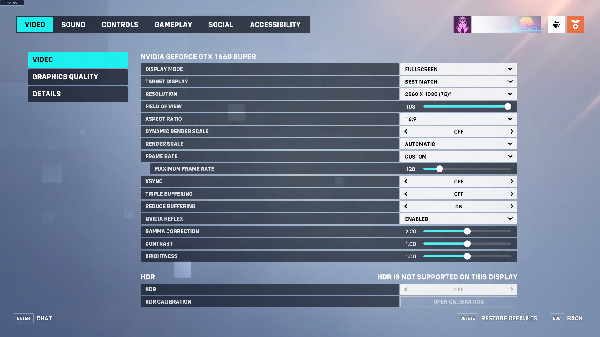
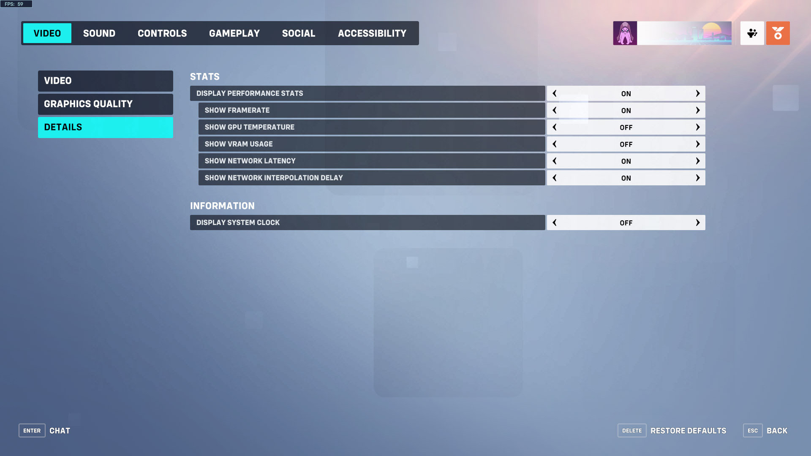
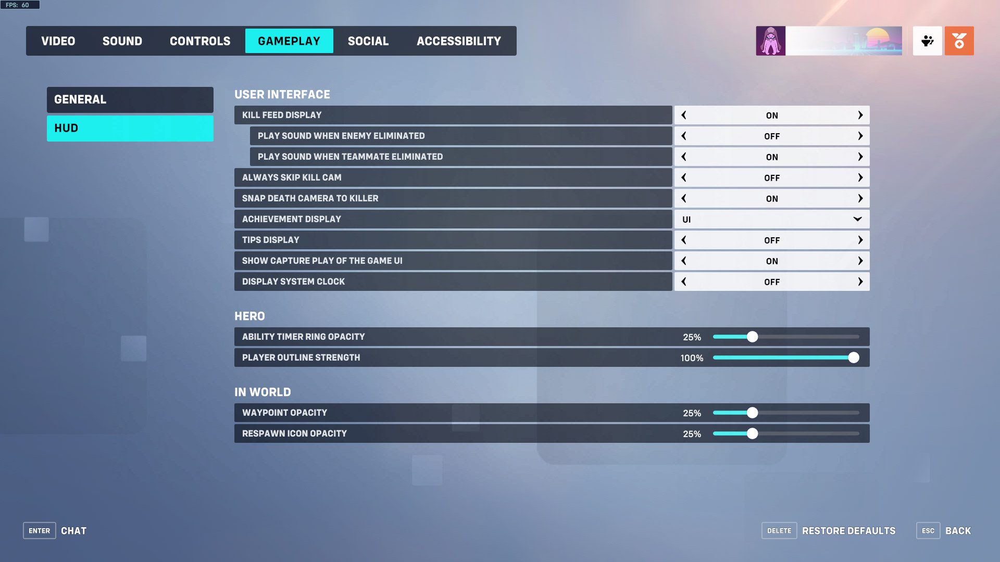
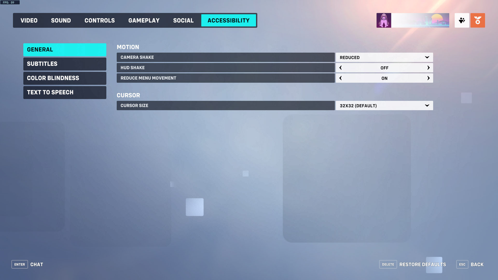
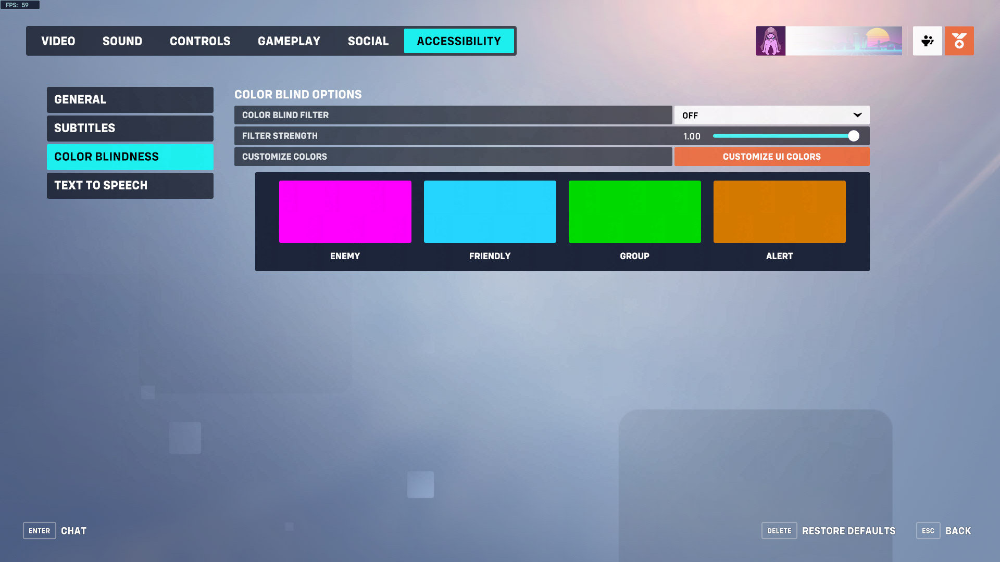

# Settings
Configuration options for third party software.

## Mouse
When using different settings, measure and adjust [src/horus/hero.cpp](src/horus/hero.cpp).

Configure mouse speed in `Control Panel > Mouse Properties > Pointer Options`.

```
+ Motion
  Select a pointer speed: 2/10 (3rd notch)
  [ ] Enhance pointer precision
```

Configure mouse acceleration in [Raw Accel][rawaccel].

```
Sens Multiplier: 1.3
Y/X Ratio: 1.1
Rotation: 0
+ Motivity
  [x] Gain
  Growth Rate: 1.5
  Motivity: 2.5
  Midpoint: 30
```

## OBS Studio
The "Output" settings are optional.

```
Settings
+ General
  ☐ Automatically check for updates on startup
+ Output
  Output Mode: Advanced
  + Recording
    Container Format: mkv
    Encoder: NVIDIA NVENC H.264
    Rate Control: VBR
    Bitrate: 16000
    Max Bitrate: 48000
    Preset: Quality
    Profile: high
    ☐ Look-ahead
    ☑ Psycho Visual Tuniung
    Max B-frames: 2
+ Video
  Base (Canvas) Resolution: 1920x1080
  Output (Scaled) Resolution: 1920x1080
  Downscale Filter: Bilinear (Fastest, but blurry if scaling)
  Integer FPS Value: 75

Sources
+ Overwatch
  Mode: Capture specific window
  Window: [Overwatch.exe]: Overwatch
  Window Match Priority: Match title, otherwise find window of the same executable
  ☐ SLI/Crossfire Capture Mode (Slow)
  ☐ Allow Transparency
  ☐ Limit capture framerate
  ☑ Capture Cursor
  ☑ Use anti-cheat compatibility hook
  ☐ Capture third-party overlays (such as steam)
  Hook Rate: Normal (recommended)
```

## Overwatch
When using a different resolution, adjust [res/draw.effect](res/draw.effect)
and [src/horus/eye.hpp](src/horus/eye.hpp).

### Controls
Settings for all heroes.

```
GENERAL
+ MOUSE
  SENSITIVITY: 1.00%
+ CONTROLLER
  + ADVANCED
    AIM SMOOTHING: 0%
    AIM EASE IN: 0%
+ RETICLE: DOT
  + AVANCED
    SHOW ACCURACY: ON
    COLOR: WHITE
    THICKNESS: 1
    CROSSHAIR LENGTH: 25
    CENTER GAP: 30
    OPACITY: 30%
    OUTLINE OPACITY: 100%
    DOT SIZE: 6
    DOT OPACITY: 100%
    SCALE WITH RESOLUTION: OFF
+ HERO
  SHOW FRIENDLY OUTLINES: ALWAYS
+ WEAPONS & ABILITIES
  EQUIP WEAPON 1: SCROLL WHEEL UP
  EQUIP WEAPON 2: SCROLL WHEEL DOWN
  QUICK MELEE: C

INTERFACE
+ HIGHLIGHTS
  CAPTURE HIGHLIGHT: (EMPTY)
+ MISCELLANEOUS
  TAKE SCREENSHOT: F5

COMMUNICATION
+ COMMUNICATION
  COMMUNICATION MENU: V
+ PING
  PING - IN WORLD: G
  ENEMY: MIDDLE MOUSE BUTTON
+ PING - OPTIONS
  ENEMY PING SENSITIVITY: 100%
  DOUBLE-PRESS SPEED: 0.1
  PING WHEEL PRESS DELAY: 0.01
  PING OPACITY: 100.0%
+ EMOTES
  + EMOTE MENU: (EMPTY)
    EMOTE (DOWN): B
+ VOICE LINES
  + VOICE LINE MENU: (EMPTY)
    VOICE LINE (UP): 1
    VOICE LINE (RIGHT): 2
    VOICE LINE (DOWN): 3
    VOICE LINE (LEFT): 4
```

Other controls settings are documented in [src/horus/hero.cpp](src/horus/hero.cpp).

### Video




### Gameplay


### Accessibility



[rawaccel]: https://github.com/a1xd/rawaccel
