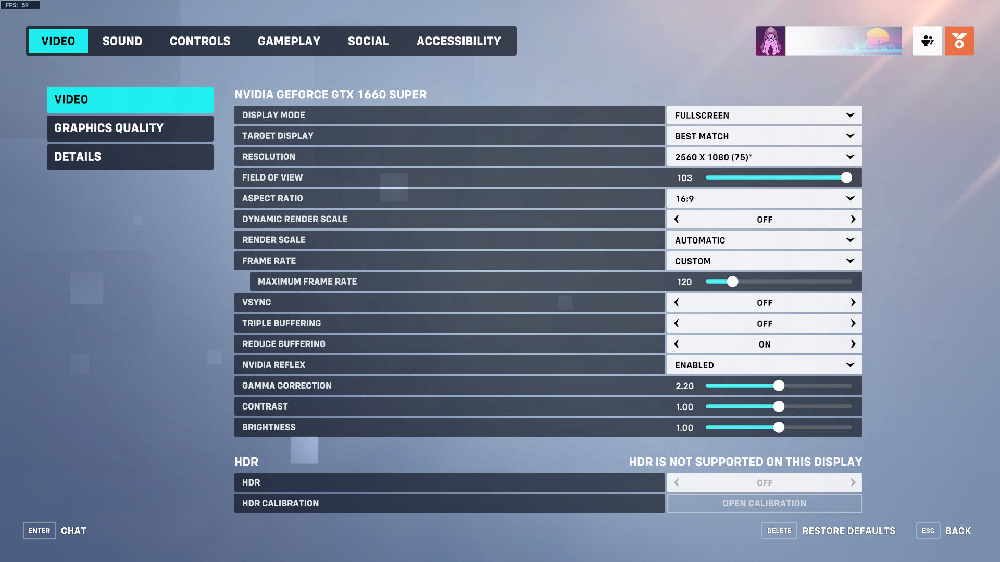
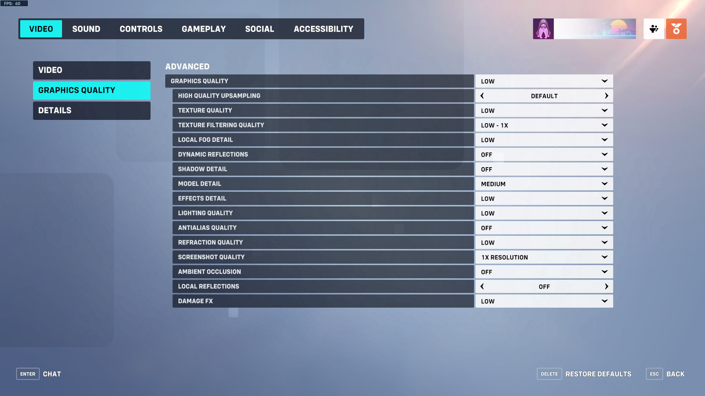
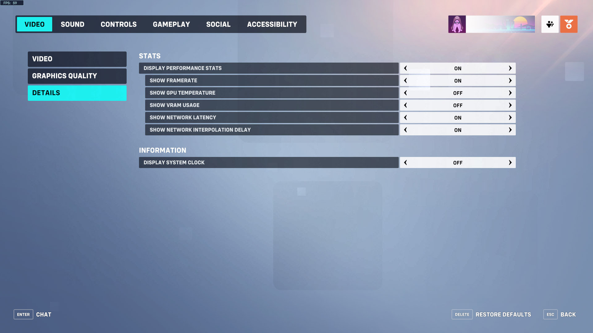
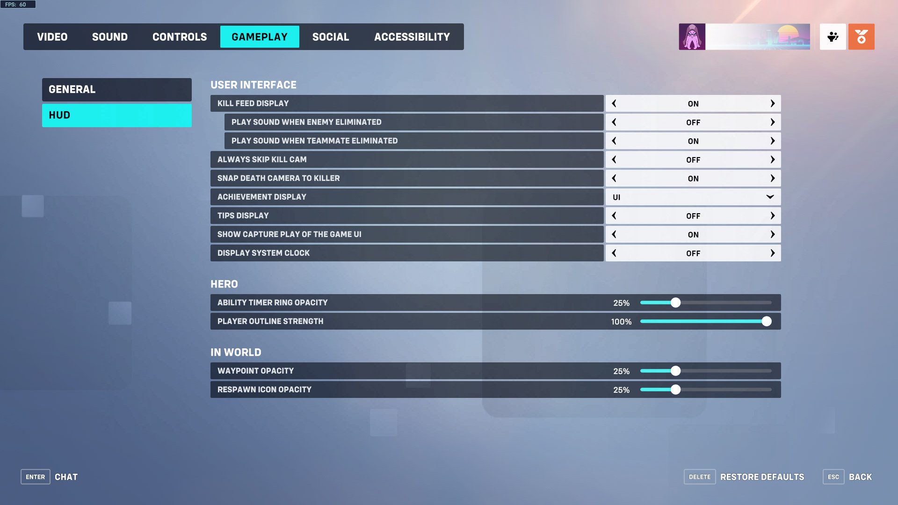
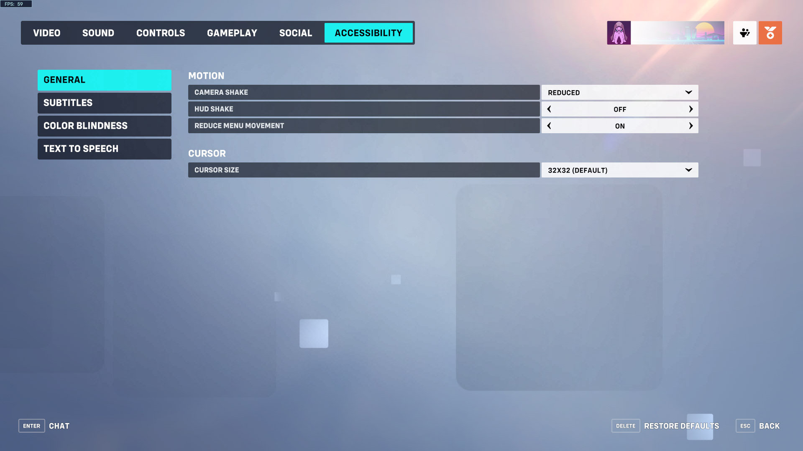

# Settings
Configuration options for third party software.

## Mouse
When using different settings, measure and adjust [src/horus/hero.cpp](src/horus/hero.cpp).

Configure mouse speed in `Control Panel > Mouse Properties > Pointer Options`.

```
+ Motion
  Select a pointer speed: 2/10 (3rd notch)
  ☐ Enhance pointer precision
```

Configure mouse acceleration in [Raw Accel][rawaccel].

```
Sens Multiplier: 1.3
Y/X Ratio: 1.1
Rotation: 0
+ Motivity
  ☑ Gain
  Growth Rate: 1.5
  Motivity: 2.5
  Midpoint: 30
```

## OBS Studio
Configure OBS (the `Output` and `Audio` settings are optional).

```
+ General
  ☐ Automatically check for updates on startup
+ Output
  Output Mode: Advanced
  + Recording
    Type: Standard
    Recording Path: C:/OBS/videos
    Container Format: mkv
    Audio Track: ☑ 1 ☑ 2 ☐ 3 ☐ 4 ☐ 5 ☐ 6
    Encoder: NVIDIA NVENC H.264
    Keyframe Interval (seconds, 0=auto): 0
    ☐ Look-ahead
    ☑ Psycho Visual Tuniung
    Max B-frames: 2
+ Audio
  + Global Audio Devices
    Mic/Auxilary Audio: Microphone
  + Hotkeys
    Mic/Aux ☑ Enable Push-to-talk
    Push-to-talk delay: 0ms
+ Video
  Base (Canvas) Resolution: 1920x1080
  Output (Scaled) Resolution: 1920x1080
  Downscale Filter: Bilinear (Fastest, but blurry if scaling)
  Integer FPS Value: 120
+ Hotkeys
  Start Recording: Ctrl + Home
  End Recording: Ctrl + End
  + Mix/Aux
    Push-to-talk: `
```

Configure `Output > Recording` rate control for debugging (1050 MiB/Minute).

```
Rate Control: Lossless
Preset: Max Quality
Profile: high
```

Configure `Output > Recording` rate control for recording (200 MiB/Minute).

```
Rate Control: VBR
Bitrate: 32000 Kbps
Max Bitrate: 64000 Kbps
Preset: Performance
Profile: high
```

### Sources
Provide a game source for the plugin.

```
+ Game Capture
  Mode: Capture specific window
  Window: [Overwatch.exe]: Overwatch
  Window Match Priority: Match title, otherwise find window of the same executable
  ☐ SLI/Crossfire Capture Mode (Slow)
  ☐ Allow Transparency
  ☐ Limit capture framerate
  ☑ Capture Cursor
  ☑ Use anti-cheat compatibility hook
  ☐ Capture third-party overlays (such as steam)
  Hook Rate: Normal (recommended)
+ Filters
  Horus
```

### Audio Mixer
Record desktop audio and microphone separately.

```
Desktop Audio > Advanced Audio Properties
+ Desktop Audio
  Tracks: ☑ 1 ☐ 2 ☐ 3 ☐ 4 ☐ 5 ☐ 6
+ Mic/Aux
  Tracks: ☐ 1 ☑ 2 ☐ 3 ☐ 4 ☐ 5 ☐ 6
  Mono: ☑
```

## Kdenlive
Configure project defaults and create export preset for YouTube.

```
Settings > Configure Kdenlive...
+ Project Defaults
  + Full HD 1080
    1920x1080 120.00fps
  Video tracks: 1
  Audio tracks: 2
  Audio channels: 2 channels (stereo)
  Timeline Preview: x264-nvenc
Project > Render...
+ Presets > Create new preset
  + Video
    Group: Lossless/HQ
    Preset name: YouTube 1080p60
    Container: mp4
    ☑ Resolution: 2560 x 1440
    ☑ Frame Rate: 60/1
    ☑ Scanning: Progressive
    Codec: hevc_nvenc
    Rate Control: Average Bitrate
    ☑ Bitrate: 60000k
    GOP: 30 frame(s)
    B Frames: 2 frame(s)
  + Audio
    ☑ Channels: 2 (stereo)
    Codec: aac
    ☑ Sample Rate: 48000 Hz
    Rate Control: CBR - Constant Bitrate
    Bitrate: 160k
```

## Overwatch
When using a different resolution, adjust [res/draw.effect](res/draw.effect)
and [src/horus/eye.hpp](src/horus/eye.hpp).

### Controls
Configure settings for all heroes.

```
GENERAL
+ MOUSE
  SENSITIVITY: 1.00%
+ CONTROLLER
  + ADVANCED
    AIM SMOOTHING: 0%
    AIM EASE IN: 0%
+ RETICLE: DOT
  + AVANCED
    SHOW ACCURACY: ON
    COLOR: WHITE
    THICKNESS: 1
    CROSSHAIR LENGTH: 25
    CENTER GAP: 30
    OPACITY: 30%
    OUTLINE OPACITY: 100%
    DOT SIZE: 6
    DOT OPACITY: 100%
    SCALE WITH RESOLUTION: OFF
+ HERO
  SHOW FRIENDLY OUTLINES: ALWAYS
+ WEAPONS & ABILITIES
  EQUIP WEAPON 1: SCROLL WHEEL UP
  EQUIP WEAPON 2: SCROLL WHEEL DOWN
  QUICK MELEE: C

INTERFACE
+ HIGHLIGHTS
  CAPTURE HIGHLIGHT: (EMPTY)
+ MISCELLANEOUS
  TAKE SCREENSHOT: F5

COMMUNICATION
+ COMMUNICATION
  COMMUNICATION MENU: V
+ PING
  PING - IN WORLD: G
  ENEMY: MIDDLE MOUSE BUTTON
+ PING - OPTIONS
  ENEMY PING SENSITIVITY: 100%
  DOUBLE-PRESS SPEED: 0.1
  PING WHEEL PRESS DELAY: 0.01
  PING OPACITY: 100.0%
+ EMOTES
  + EMOTE MENU: (EMPTY)
    EMOTE (DOWN): B
+ VOICE LINES
  + VOICE LINE MENU: (EMPTY)
    VOICE LINE (UP): 1
    VOICE LINE (RIGHT): 2
    VOICE LINE (DOWN): 3
    VOICE LINE (LEFT): 4
```

Other controls settings are documented in [src/horus/hero.cpp](src/horus/hero.cpp).

### Video




### Gameplay


### Accessibility



[rawaccel]: https://github.com/a1xd/rawaccel
